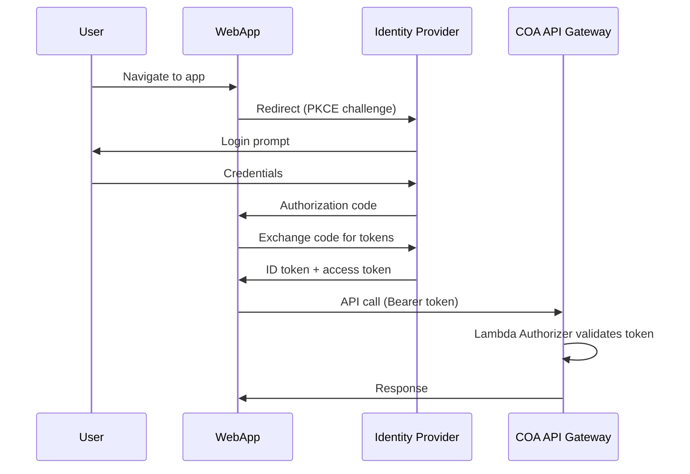

# Authentication Setup Guide

This guide covers how to configure authentication for Context Ontology Accelerator (COA). The platform supports AWS Cognito User Pools and any OIDC-compliant identity provider.

## Overview

COA uses **OIDC Authorization Code flow with PKCE** for all user authentication. Every API request requires a valid Bearer token issued by your configured identity provider.



## Option A: AWS Cognito User Pool

If you deployed with the default `idp_type = "COGNITO"` in
`infra-tf/shared.tfvars` (no `oidc_settings` configured — see
"Option B: External OIDC Provider" below for using your own IdP instead),
the User Pool, app client, and an initial admin user are **already
provisioned automatically** — there is nothing left to create manually for
a first login.

### What's Already Set Up

The Terraform `auth-idp` module (`infra-tf/modules/foundation/auth-idp/`)
creates, at deploy time:

- A Cognito **User Pool** with a hosted UI domain
- A **web app client** (Authorization Code + PKCE, no client secret) used by the React app
- A separate **MCP/CLI client** (`localhost:9876` redirect) for IDE integrations
- An **`Admin` group**, pre-seeded in the authorization tables so that any user
  in this group is automatically granted the `platform-admin` role — no
  manual grant needed
- An **initial admin user**, created via the module, added to the
  `Admin` group, with a Cognito-generated temporary password emailed to them
  (the user must change it on first login)

Find these values in the stack outputs:

```bash
cd infra-tf/stacks/10-foundation
terraform output
```

Key outputs:
- `user_pool_id` — the Cognito User Pool ID
- `user_pool_client_id` — the web app client ID
- `mcp_client_id` — the MCP/CLI client ID
- `cognito_domain_url` — the hosted UI domain

**To sign in as the initial admin:** the default email is a placeholder
(`nobody@amazon.com`) that you cannot receive mail at — the temporary
password Cognito emails on user creation would go nowhere useful.
**Set `initial_admin_email` in `infra-tf/shared.tfvars` before your first
apply** so the admin user is created under an email you control:

```hcl
initial_admin_email = "you@yourcompany.com"
```

If you already applied with the placeholder, re-applying with
`initial_admin_email` set creates a **new, separate** admin user under your
real email (the username is derived from the email, so it doesn't rename or
update the placeholder user — the old `nobody@amazon.com` user is left
behind, unused, in the User Pool). Alternatively, create a user manually and
add it to the `Admin` group (see "Add Additional Users" below).

### Adding Additional Users and Groups

Everything below this point is **optional** — only needed if you want
additional users beyond the auto-provisioned admin, or additional
role-mapped groups beyond `Admin`.

#### Configure Additional Groups for Role Mapping

The `Admin` group → `platform-admin` mapping is pre-seeded automatically.
For any other role, create the Cognito group and grant the corresponding
role via the [Role & Permission Management Guide](role-permission-management.md)
— creating a group in Cognito does **not** by itself grant any role; only
`Admin` is pre-wired:

```bash
# Create an additional group (still needs an explicit role grant — see above)
aws cognito-idp create-group \
  --user-pool-id us-east-1_XXXXX \
  --group-name data-stewards \
  --description "Data stewards across namespaces"
```

Group memberships are included in the `cognito:groups` claim of the ID token. The COA authorizer reads this claim to resolve group-based grants.

#### Add Additional Users

```bash
aws cognito-idp admin-create-user \
  --user-pool-id us-east-1_XXXXX \
  --username alice@company.com \
  --user-attributes Name=email,Value=alice@company.com

aws cognito-idp admin-add-user-to-group \
  --user-pool-id us-east-1_XXXXX \
  --username alice@company.com \
  --group-name Admin
```

## Option B: External OIDC Provider

COA supports any OIDC-compliant provider (Okta, Azure AD, Auth0, Keycloak, etc.).

### 1. Register COA as a Client

In your identity provider:

1. Create a new OIDC application (SPA / public client)
2. Set the **redirect URI** to `https://<your-app-domain>/authenticate/`
3. Set the **post-logout redirect** to `https://<your-app-domain>/`
4. Enable **Authorization Code flow with PKCE**
5. Request scopes: `openid`, `email`, `profile`

### 2. Configure Group Claims

The authorizer reads group memberships from the ID token. Configure your IdP to include groups in a claim, then set the matching claim name as `group_claim` in the `oidc_settings` Terraform variable (see "3. Configure the Authorizer Lambda" below) — this becomes the `GROUP_CLAIM_NAME` environment variable on the authorizer Lambda automatically (default: `"groups"`).

| Provider | Claim name | Configuration |
|----------|-----------|---------------|
| Okta | `groups` | Add "groups" scope, configure group claim in authorization server |
| Azure AD | `groups` | Configure token claims in App Registration → Token Configuration |
| Keycloak | `groups` | Add "groups" mapper to client scope |
| Auth0 | `https://your-app/groups` | Add a Rule/Action to include roles in token; set `group_claim` in `oidc_settings` to match |

### 3. Configure the Authorizer Lambda

You do **not** set these directly as Lambda environment variables — they're
derived automatically from the `oidc_settings` variable in
`infra-tf/shared.tfvars` (see "Step 5: Deploy Context Ontology Accelerator"
in the Okta walkthrough below) and wired onto the authorizer's environment
at deploy time by the `auth-idp` module (which passes them to the `api`
module's authorizer Lambda). Setting the right value in `oidc_settings` is
all that's needed — there is no separate authorizer configuration step for
a standard Terraform deploy.

| `oidc_settings` field | Resulting Lambda env var | Value |
|---|---|---|
| `issuer_url` | `JWKS_ISSUER` | Your OIDC issuer URL (e.g. `https://login.microsoftonline.com/{tenant}/v2.0`) |
| `jwks_uri` | `JWKS_URI` | (Optional) Explicit JWKS endpoint if not at `{issuer}/.well-known/jwks.json` |
| `client_id` | `CLIENT_ID` | Your app's client ID (used as expected `aud` claim) |
| `group_claim` | `GROUP_CLAIM_NAME` | Token claim containing group list (default: `"groups"`) |

If you're deploying outside Terraform entirely (a non-standard setup),
you'd set these Lambda environment variables directly on the authorizer
function — but for the standard flow, editing `shared.tfvars` and running
`make apply-10-foundation apply-60-api-edge` is the only step required.

## Configure the Web App

When you deploy with Terraform, the web app's runtime configuration
(`runtime-config.json`) is **generated and uploaded to S3 automatically** —
no manual editing required. The `web` module builds it from the deployed
outputs (OIDC authority, client ID, API endpoint, and region) so the React
app discovers its backends without a rebuild:

```json
{
  "region": "us-east-1",
  "stage": "dev",
  "authority": "https://cognito-idp.us-east-1.amazonaws.com/us-east-1_XXXXX",
  "clientId": "your-client-id",
  "apiEndpoint": "https://your-api.execute-api.us-east-1.amazonaws.com/prod/",
  "serveRuntimeArn": "arn:aws:bedrock-agentcore:us-east-1:123456789012:runtime/my-runtime"
}
```

| Field | Source (set automatically on deploy) |
|-------|--------------------------------------|
| `region` | Deployment region |
| `stage` | Environment name (e.g. `dev`) |
| `authority` | OIDC issuer URL. For Cognito: `https://cognito-idp.{region}.amazonaws.com/{user-pool-id}` |
| `clientId` | The OAuth client ID from the auth stack |
| `apiEndpoint` | The deployed API Gateway endpoint |
| `serveRuntimeArn` | AgentCore Runtime ARN for SSE streaming queries |

!!! note
    You only need to set these values manually when running the web app outside
    of a Terraform deployment (for example, local development against a remote
    backend). For standard deployments, `terraform apply` handles it.

## How Role Resolution Works

When a user authenticates, the authorizer resolves their permissions:

1. **Validate token** — Verify JWT signature against the JWKS endpoint
2. **Extract principal** — Read `email` (or `sub`) as the principal ID
3. **Extract groups** — Read the configured group claim
4. **Query grants** — Look up grants for `User::{email}` and `Group::{group}` in DynamoDB
5. **Evaluate Cedar** — Load policies for the resolved roles and evaluate the request

Grants can be assigned to individual users OR to IdP groups. When a user belongs to a group that has a grant, they inherit that role.

## Verifying Authentication

After setup, verify the flow works end-to-end:

```bash
# Get a token (via Cognito hosted UI or your IdP's token endpoint)
TOKEN="eyJ..."

# Test an API call
curl -s -H "Authorization: Bearer $TOKEN" \
  https://your-api.execute-api.us-east-1.amazonaws.com/prod/namespaces \
  | python3 -m json.tool
```

A successful response returns your namespace list. A `403` indicates the token is valid but the user lacks permissions — see the [Role & Permission Management Guide](role-permission-management.md) to grant access.

## Token Usage

Context Ontology Accelerator uses **ID tokens** for all authentication across every interface:

| Interface | Token type | Key claims |
|-----------|-----------|------------|
| **REST API** (API Gateway) | ID token | `aud`, `email`, `groups` |
| **Playground** (AgentCore SSE) | ID token | `aud`, `email`, `groups` |
| **MCP** (AgentCore Runtime) | ID token | `aud`, `email`, `groups` |

The ID token carries the user's identity (`email`), group memberships (`groups` claim), and audience (`aud` = client ID). AgentCore Runtime validates the `aud` claim — which is present on ID tokens from any OIDC-compliant provider. Access tokens are **not used**.

### Getting a token (dev only)

```bash
# ID token (used for all APIs)
aws cognito-idp initiate-auth --auth-flow USER_PASSWORD_AUTH \
  --client-id <CLIENT_ID> --auth-parameters USERNAME=<email>,PASSWORD=<pass> \
  --region <region> --query "AuthenticationResult.IdToken" --output text
```

Production uses Authorization Code + PKCE (handled by the web app automatically).

## Troubleshooting

| Symptom | Cause | Fix |
|---------|-------|-----|
| Login redirect fails | Callback URL mismatch | Verify redirect URI in IdP matches `<origin>/authenticate/` exactly |
| `401 Unauthorized` | Token expired or malformed | Check token expiry; verify the `authority` URL is correct |
| `403 Forbidden` after login | User has no grants | Assign a role via the Identity page or API (see [Role & Permission Management](role-permission-management.md)) |
| Groups not appearing | Wrong claim name | Verify `GROUP_CLAIM_NAME` matches your IdP's claim; inspect the raw ID token |
| "Token refresh failed" in browser | Silent refresh blocked | Ensure your IdP allows iframe-based token refresh, or reduce token lifetime |
| `Token is missing the "aud" claim` | ID token misconfigured | Verify the authorization server audience matches your app's client ID |
| `Token missing required email claim` | Email claim not included | Ensure the IdP includes `email` in the ID token claims |

---

## Okta Setup (Step-by-Step)

This walkthrough covers configuring Okta as the external OIDC identity provider for Context Ontology Accelerator (Option B above).

### Prerequisites

- An Okta tenant (e.g. `https://your-org.okta.com`)
- Admin access to create applications and authorization servers in Okta
- (Optional) Your Context Ontology Accelerator UI custom domain. If not using custom domains, you can update callback URLs after deployment using the generated CloudFront domain.

### Step 1: Create an Application in Okta

1. Navigate to **Applications → Create App Integration**
2. Select **OIDC - OpenID Connect** as sign-in method
3. Select **Single-Page Application** as application type, then press **Next**
4. Configure the application:

| Setting | Value |
|---------|-------|
| App integration name | `Context Ontology Accelerator` (or name of your choice) |
| Grant type | **Authorization Code** + **Refresh Token** |
| Sign-in redirect URIs | `https://<UI_DOMAIN>/authenticate/` and `http://localhost:9876/oauth/callback` (for MCP/CLI) |
| Sign-out redirect URIs | `https://<UI_DOMAIN>/` |
| Assignments | Select users/groups who should access Context Ontology Accelerator |

5. Click **Save**
6. On the application page, note the **Client ID**

!!! tip
    If you don't have a custom domain yet, use placeholder URLs. After deployment, update with the CloudFront domain from the stack outputs.

!!! note "No client secret needed"
    Since the application type is **Single-Page Application**, Okta issues a
    public client with no client secret (per OAuth 2.0 PKCE for public clients,
    RFC 8252) — you'll only need the **Client ID**. The direct-OIDC integration
    (`idp_type = "OIDC"`) has no `client_secret` field in its config; only the
    separate Cognito-federation path (`oidcProviders`, used when federating an
    external OIDC IdP *through* Cognito rather than replacing it) accepts one.
    If Okta's app page shows a client secret, you selected the wrong
    application type — switch to Single-Page Application.

### Step 2: Create a Custom Authorization Server

Okta's `default` authorization server cannot include group claims in ID tokens. You **must** create a custom one — the group claim cannot be added to `default`, so skipping this step means role mapping will never work.

1. Navigate to **Security → API → Authorization Servers**
2. Click **Add Authorization Server**

| Setting | Value |
|---------|-------|
| Name | `Context Ontology Accelerator` (or name of your choice) |
| Audience | `https://<UI_DOMAIN>` (or placeholder — update post-deploy) |
| Description | Authorization server for Context Ontology Accelerator |

3. Note the **Issuer URI** (e.g. `https://your-org.okta.com/oauth2/aus...`)

### Step 3: Add a Groups Claim

1. On your custom authorization server, select the **Claims** tab
2. Click **Add Claim**

| Setting | Value |
|---------|-------|
| Name | `groups` |
| Include in token type | **ID Token** |
| Value type | **Groups** |
| Filter | Matches regex `.*` (all groups) |

3. Click **Create**

### Step 4: Create an Access Policy

1. On your custom authorization server, select the **Access Policies** tab
2. Click **Add New Access Policy**

| Setting | Value |
|---------|-------|
| Name | `OntologyAcceleratorAccessPolicy` |
| Description | Access policy for Context Ontology Accelerator |
| Assign to | **All clients** (or restrict to your Context Ontology Accelerator client ID) |

3. Click **Create Policy**, then **Add Rule**:
   - Ensure **Authorization Code** is enabled under "Grant type"
   - Configure user/group scope and token lifetimes as needed (defaults are fine)
   - Ensure requested scopes include **openid** at minimum
4. Click **Create Rule**

### Step 5: Deploy Context Ontology Accelerator

Set the following block in `infra-tf/shared.tfvars`:

```hcl
idp_type = "OIDC"

oidc_settings = {
  issuer_url  = "https://your-org.okta.com/oauth2/aus..."
  client_id   = "0oa..."
  jwks_uri    = "https://your-org.okta.com/oauth2/aus.../v1/keys"
  group_claim = "groups"
}

initial_claims_mappings = [
  {
    group_value  = "Context Ontology Accelerator Admins"
    mapped_roles = ["platform-admin"]
  }
]
```

Then deploy:

```bash
cd infra-tf
make apply-10-foundation apply-60-api-edge
```

The `auth-idp` module reads these values and wires the issuer URL + client
ID into the API Gateway authorizer, AgentCore Runtime (Serve + MCP), and
the web app's `runtime-config.json` — all automatically.

### Step 6: Post-Deploy — Update Okta Settings

If you used placeholder URLs, update them now:

1. Get the CloudFront domain from stack outputs:
   ```bash
   cd infra-tf/stacks/60-api-edge
   terraform output cloudfront_distribution_domain_name
   ```

2. **Update the Okta Application:**
   - Sign-in redirect URI → `https://<CloudFront_URL>/authenticate/`
   - Sign-out redirect URI → `https://<CloudFront_URL>/`

3. **Update the Authorization Server Audience:**
   - Navigate to **Security → API → Authorization Servers → your server**
   - Set **Audience** to `https://<CloudFront_URL>`

### Step 7: Verify

1. Navigate to your Context Ontology Accelerator UI URL
2. You should be redirected to Okta's login page
3. After authenticating, verify you land on the Context Ontology Accelerator dashboard
4. Check that your group memberships appear correctly by navigating to the Identity page

### Okta-Specific Notes

- **Group claim format:** Okta sends groups as a JSON array by default, which Context Ontology Accelerator handles natively
- **Token lifetimes:** The MCP client benefits from longer token lifetimes (24h+ ID token). Configure this in the access policy rule under "Token Lifetime"
- **MCP/CLI flow:** The `http://localhost:9876/oauth/callback` redirect URI enables PKCE-based auth for IDE integrations (Kiro, Claude Desktop, Cursor). Add this to your Okta app's allowed redirect URIs
- **Single client:** In OIDC mode, Context Ontology Accelerator uses the same Okta client ID for both the web app and MCP/CLI flows. If you need separate token lifetimes or scopes per interface, register a second application in Okta and pass its client ID via `oidc_settings.mcp_client_id` (future enhancement)
