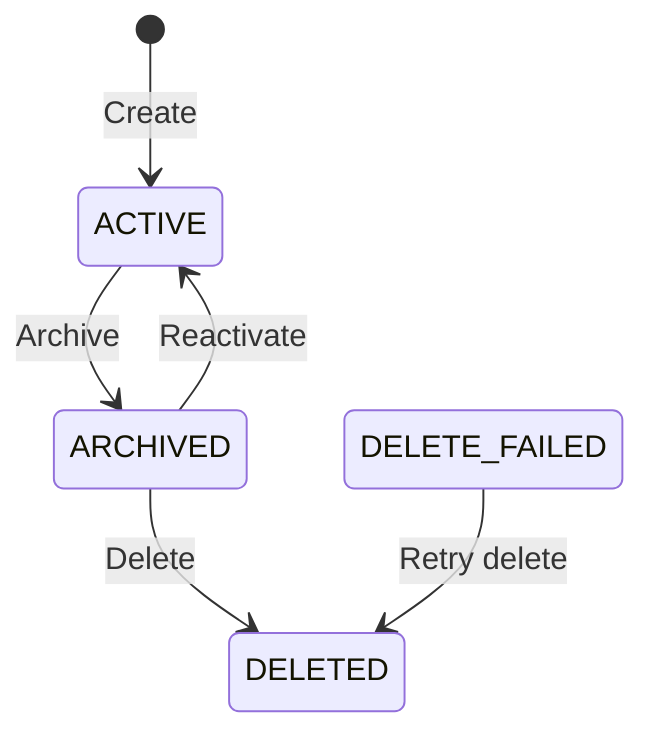

# Namespace Management Guide

Namespaces are the top-level organizational unit in Context Ontology Accelerator. Each namespace is an isolated workspace containing data sources, ontologies, metrics, and access grants. Under the hood, each namespace maps 1:1 to an Amazon DataZone project.

!!! tip "Full request/response schemas"
    This guide shows the workflow and key behaviors. For the complete request/response schema, every field, and status codes for each endpoint below, see the **[API Reference](#/api-reference)** (Control Plane API → Namespace management) — it's generated directly from the API contract and always current.

## Creating a Namespace

### Via Web UI

1. Navigate to **Administration → Namespaces**
2. Click **Create namespace**
3. Fill in:
   - **Name** — unique identifier (lowercase, hyphens allowed, max 64 chars)
   - **Display name** — human-friendly label
   - **Description** — purpose of this namespace
   - **Owner** — email of the initial owner (will receive `namespace-owner` role automatically)
4. Click **Create**

### Via API

`POST /namespaces` with `name`, `displayName`, `description`, and `owner` —
see **CreateNamespace** in the [API Reference](#/api-reference) for the full
request/response schema. Returns `201 Created` with the new namespace
(`namespaceId`, `status: ACTIVE`, `dataZoneProjectId`, `athenaWorkgroupName`,
etc.).

### What Happens on Create

When you create a namespace, the platform:

1. Reserves the name (prevents duplicates)
2. Creates a DataZone project in the configured domain
3. Provisions an Athena workgroup for query isolation
4. Copies built-in role templates into the namespace
5. Grants the `namespace-owner` role to the specified owner

## Namespace Lifecycle

Namespaces follow a defined lifecycle with controlled state transitions:



| Status | Description |
|--------|-------------|
| `ACTIVE` | Fully operational — sources can be connected, queries can run |
| `ARCHIVED` | Frozen — **mutating** operations (managing sources, ontologies, metrics, grants, roles) are blocked; reads and queries still work. Data is retained for audit. |
| `DELETED` | Permanently removed — all resources cleaned up |
| `DELETE_FAILED` | Deletion partially failed — retry the delete to resume |

> **Enforcement:** the mutation block on `ARCHIVED` namespaces is enforced
> centrally in the API Gateway Cedar authorizer (a `forbid` policy that
> overrides all roles, including `platform-admin`). To make changes again,
> reactivate the namespace first.

### Archiving and Reactivating a Namespace

Both use `PATCH /namespaces/{namespaceId}/status` with `{ "status": "ARCHIVED" }`
or `{ "status": "ACTIVE" }` — see **UpdateNamespaceStatus** in the
[API Reference](#/api-reference).

## Updating a Namespace

`PUT /namespaces/{namespaceId}` updates display name, description, or owner
— see **UpdateNamespace** in the [API Reference](#/api-reference) for all
updatable fields.

## Deleting a Namespace

Deletion is destructive and asynchronous. Calling `DELETE` starts a Step
Functions pipeline that cascades through and removes **all** of the
namespace's resources — sources, metrics, ontology data, and the underlying
AWS resources (Athena workgroup, DataZone project, VKG service, Cloud Map
entries, role mappings, and role definitions) — before deleting the namespace
record itself. You do **not** need to delete sources, ontologies, or metrics
yourself first; the pipeline deletes all child resources for you.

### Prerequisites

Before deleting, the namespace must be:

1. **Archived (or already `DELETE_FAILED`)** — only `ARCHIVED` or
   `DELETE_FAILED` namespaces can be deleted; `ACTIVE` namespaces must be
   archived first (see "Archiving and Reactivating a Namespace" above)

That's the only precondition on the namespace's *contents*. The only thing
that can still block the call is something **actively in-flight** right now
— a source mid-scan/enrichment, an ontology induction/ingest job that hasn't
reached a terminal state, or a metric import job still `IN_PROGRESS` — since
deleting a child resource out from under a job that's still writing to it
would race. Merely *having* sources, ontologies, or metrics does not block
deletion; those are removed by the pipeline itself.

### Delete

`DELETE /namespaces/{namespaceId}` — see **DeleteNamespace** in the
[API Reference](#/api-reference).

Returns `202 Accepted` immediately — deletion runs in the background. Poll
`GET /namespaces/{namespaceId}` for the namespace's `status`, which
transitions `DELETING` → `DELETED` on success (the namespace then 404s once
its record is removed) or `DELETING` → `DELETE_FAILED` if a step fails after
exhausting retries.

If something is still actively running, you'll receive a `409 Conflict`
instead of starting the pipeline:

```json
{
  "message": "Cannot delete namespace: 2 source(s) actively scanning or enriching. Wait for these jobs to finish.",
  "blockers": ["2 source(s) actively scanning or enriching"]
}
```

Wait for the in-flight job(s) to reach a terminal state, then retry the
`DELETE` call.

### Deletion Pipeline

The pipeline runs these steps in order, each with 3 retries (exponential
backoff) before giving up:

1. **Delete Sources** — deletes all data sources in the namespace via the
   Sources API
2. **Delete Metrics** — deletes all metrics via the Metrics API
3. **Delete Ontology** — tears down ontology graph data and artifacts via the
   ontology engine
4. **Delete Platform Resources** — Athena workgroup, DataZone project, VKG
   ECS service, Cloud Map service-discovery entries, role mappings, and role
   definitions
5. **Finalize** — deletes the namespace record and releases its name
   reservation

Steps 1–4 are best-effort and retried — the underlying cleanup calls are
already designed to be safe to retry (idempotent against a resource that's
already gone). **Finalize is the only step that must succeed outright**: if
it fails, the namespace stays visible (rather than silently vanishing while
"mostly" deleted) so it remains retryable.

If **any** step exhausts its retries, the namespace lands in `DELETE_FAILED`.
Simply retry the `DELETE` call — the pipeline resumes from the beginning, and
steps for resources that are already gone are no-ops.

## Listing Namespaces

`GET /namespaces`, paginated via `maxResults`/`nextToken` — see
**ListNamespaces** in the [API Reference](#/api-reference) for the full
parameter and response shape.

All authenticated users can list namespaces (the default Cedar policy permits `list` for all users). However, accessing a namespace's resources requires an explicit role grant.

## Namespace Resources

Once a namespace is created, you can connect:

| Resource | Description | Guide |
|----------|-------------|-------|
| Database sources | Glue Data Catalog or JDBC databases | Connect via Sources page |
| Document sources | S3 buckets or file uploads | Connect via Sources page |
| Ontologies | OWL knowledge graphs | Ontology management |
| Metrics | Governed SQL metric definitions | Metrics page |

## VKG Health Monitoring

When a namespace has an accepted ontology, the platform provisions a Virtual
Knowledge Graph (VKG) service that answers graph/SPARQL queries. `GetNamespace`
reports the current state of that service in two fields:

- **`vkgHealth`** — one of five `VkgHealthStatus` values (below). Surfaced in the
  namespace detail view in the web UI.
- **`vkgHealthReason`** — an optional, human-readable string present **only when
  `vkgHealth` is not `HEALTHY`**. It gives a short explanation of why the VKG is
  in a non-HEALTHY state so you can act without inspecting ECS directly (e.g.
  `"container health check failing"` for `DEGRADED`, `"no running task"` for
  `UNAVAILABLE`). For `HEALTHY` namespaces the field is absent.

| `vkgHealth` | Meaning | What to do |
|-------------|---------|-----------|
| `HEALTHY` | A running VKG task is passing its container health check and can answer queries. | Nothing — normal operation. |
| `DEGRADED` | A VKG task **is running** but its container health check is failing (e.g. Ontop could not load the R2RML mappings, or the OWL2QL translation is not completing). Distinct from `UNAVAILABLE`. | Check the VKG service logs in CloudWatch. Common causes: an under-provisioned task (see [VKG Task Sizing](deploying.md#vkg-task-sizing)) or a malformed mapping. |
| `UNAVAILABLE` | No VKG task is running for this namespace (desired count 0, or all tasks stopped). | Trigger a reload, or check for a failed deployment / circuit-breaker rollback. |
| `PROVISIONING` | A VKG task is starting up or a new deployment is rolling out; health is not yet confirmed. | Wait — this is transient during create/reload. |
| `UNKNOWN` | No VKG service exists for this namespace (e.g. no accepted ontology yet), or the health could not be determined. | Expected before an ontology is accepted; otherwise verify the service was provisioned. |

`DEGRADED` and `UNAVAILABLE` are deliberately **disjoint**: a running-but-broken
VKG reports `DEGRADED` (not a false `HEALTHY` and not `UNAVAILABLE`), so a
silently-broken graph is visible rather than masked.

## Authorization

| Action | Required Role |
|--------|--------------|
| List namespaces | Any authenticated user |
| Create namespace | `platform-admin` only — namespace creation has no existing namespace to scope a `namespace-owner` grant to, so it requires the global role |
| View namespace details | Any namespace role (`namespace-owner`, `data-steward`, `data-analyst`, etc.) |
| Update namespace | `namespace-owner`, `namespace-maintainer`, or `platform-admin` |
| Archive/reactivate | `namespace-owner`, `namespace-maintainer`, or `platform-admin` |
| Delete namespace | `namespace-owner`, `namespace-maintainer`, or `platform-admin` |

See the [Role & Permission Management Guide](role-permission-management.md) for details on granting roles.

## Platform-Wide Roles

Platform roles apply across **all namespaces** without requiring per-namespace grants.

| Role | Description |
|------|-------------|
| `platform-admin` | Full access to all actions on all resources in all namespaces |
| `platform-viewer` | Read-only access across all namespaces (view, query, search) |

## Full Permission Matrix

| Action | platform-admin | platform-viewer | namespace-owner | data-steward | data-analyst |
|--------|:-:|:-:|:-:|:-:|:-:|
| List namespaces | ✅ | ✅ | ✅ | ✅ | ✅ |
| Create namespace | ✅ | ❌ | ❌ | ❌ | ❌ |
| Update namespace | ✅ | ❌ | ✅ | ❌ | ❌ |
| Delete namespace | ✅ | ❌ | ✅ | ❌ | ❌ |
| Manage data sources | ✅ | ❌ | ✅ | ✅ | ❌ |
| Manage ontologies | ✅ | ❌ | ✅ | ✅ | ❌ |
| Manage metrics | ✅ | ❌ | ✅ | ✅ | ❌ |
| Query data | ✅ | ✅ | ✅ | ✅ | ✅ |
| Grant permissions | ✅ | ❌ | ✅ | ❌ | ❌ |
| Manage platform grants | ✅ | ❌ | ❌ | ❌ | ❌ |
