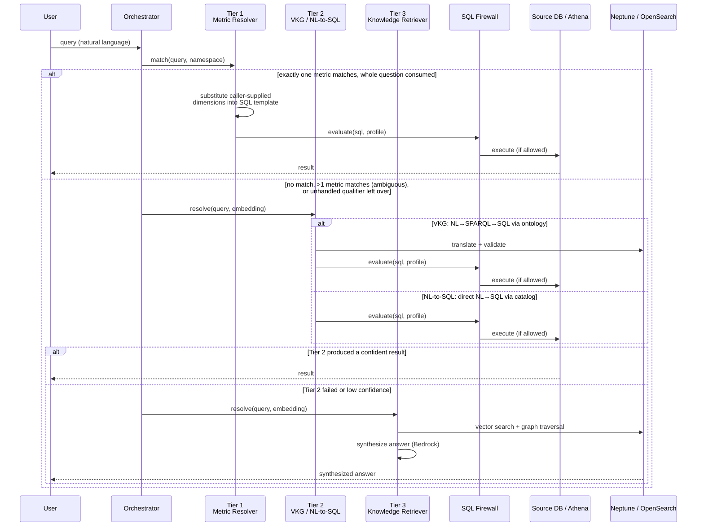

# Serve

The Serve layer is how users and AI agents query Context Ontology Accelerator. It orchestrates across multiple resolution strategies to answer natural language questions using your semantic context — metrics, ontologies, knowledge graphs, and source data.

!!! tip "Full request/response schemas"
    For the complete request/response schema for every Serve endpoint below,
    see the **[API Reference](#/api-reference)** (Data Layer (Serve) API) —
    it's generated directly from the API contract and always current.

## Query Interfaces

### Playground (Web App)

The built-in Playground provides an interactive chat interface:

1. Navigate to **Playground** in the web app
2. Select a namespace
3. Ask questions in natural language

The Playground streams responses in real-time via SSE (Server-Sent Events), showing:

- **Resolution steps**: which strategy is being tried
- **Generated SQL**: the query produced for your data
- **Results**: tables, summaries, or explanations
- **Conversation history**: multi-turn context within a session

### REST API

`POST /namespaces/{namespaceId}/query` with a natural-language `query` and
optional `options` — see **Query** in the [API Reference](#/api-reference)
for the full request/response schema.

Options:
- `execute: false` — return the generated SQL without executing it
- `tierOverride` — force a specific resolution tier (1, 2, or 3)
- `mode` — choose the execution policy: the Standard tier cascade or Deep
  Reasoning (see below)
- `strategy` — choose which Tier-2 engine answers a structured query (see below)
- `maxResults` — limit result rows
- `includeSupporting` — include supporting context in the response
- `timeoutMs` — cap the server-side resolution budget for this request. Only ever
  *lowers* the budget below the transport ceiling (a value above the ceiling is
  clamped); non-positive/invalid values are ignored.

> **⚠️ REST has a hard 29-second timeout.** The REST endpoint runs behind API
> Gateway, whose integration timeout is a fixed **29 s** (`timeoutInMillis: 29000`)
> that **cannot be raised**. A query that needs longer than 29 s server-side does
> not return over REST — it responds with:
>
> ```json
> { "error": "rest_deadline_exceeded", "limitMs": 29000,
>   "message": "Query exceeded the 29s REST timeout ... use the streaming query endpoint ..." }
> ```
>
> This is expected for long-running work — most commonly **Tier 3** knowledge
> synthesis, which routinely takes 20–90 s. The work may still be completing
> server-side; the error means only that it cannot be delivered within the REST
> budget, **not** that the service is down or the query is malformed. For those
> queries, use the **streaming endpoint** (below), which has a much larger budget.
> Fast structured lookups (Tier 1 / Tier 2 single-shot) fit comfortably inside 29 s
> and are well suited to REST.

### Streaming (recommended for interactive query)

For interactive use — and for any query that may take more than a few seconds
(Tier 3 synthesis, multi-step retrieval) — use the **streaming** path rather than
the synchronous REST endpoint. It POSTs to the AgentCore Runtime `/invocations`
endpoint with SSE (Server-Sent Events) and carries a much larger resolution budget
(**170 s** by default, `resolve_timeout_s`), so it is not subject to the 29 s API
Gateway ceiling. It also streams resolution steps, generated SQL, and results as
they are produced instead of blocking for a single response.

This is the path the [Playground](#playground-web-app) uses, and the recommended
default for building interactive clients. Reserve the synchronous REST endpoint for
short, scriptable calls where a single blocking request is simpler and the work
reliably fits inside 29 s.

#### Selecting a Tier-2 engine — `strategy`

Tier 2 can answer a structured question two ways: through the **Ontop/VKG** semantic
path (SPARQL compiled against your R2RML mappings) or through **NL→SQL**. By default
it tries NL→SQL and falls back to Ontop. Setting `strategy` pins the choice, which is
how you compare engines or require the semantic path.

| Value | Behaviour |
|---|---|
| `nl_to_sql_first` | NL→SQL, falling back to Ontop. **The default when `strategy` is omitted.** |
| `ontop_first` | Ontop, falling back to NL→SQL |
| `ontop` | Ontop only — no fallback |
| `nl_to_sql` | NL→SQL only — no fallback |
| `best` | Run both in parallel, return the higher-confidence answer |
| `deep-reasoning` | The bounded tool-use agent only; never reached as a fallback |

```json
{ "query": "how many products are there", "options": { "strategy": "ontop" } }
```

Notes:

- **Optional.** Omitting it behaves exactly as before this option existed.
- **Ignored unless the query resolves at Tier 2.** A question answered by a Tier-1
  metric or Tier-3 retrieval is unaffected.
- **An explicit value is never overridden** by automatic tier gating or per-query
  Tier-2 pruning — pinning an engine is treated as intent.
- **Orthogonal to `mode`.** `mode` decides whether the whole Tier 1→2→3 cascade is
  replaced by the Tier-3 reasoning loop; `strategy` decides which engine answers
  *within* Tier 2. Both were called "agentic" before the rebrand, so they are easy to
  confuse. `deep-reasoning` appears in both because it is the same engine reached two
  ways: `mode="deep-reasoning"` replaces the cascade and returns a prose answer, while
  `strategy="deep-reasoning"` keeps Tier-1 metric routing and returns the agent's
  answer in Tier-2 row shape.
- An unrecognised value returns **400** listing the valid ones, rather than silently
  falling back to the default.
- `ontop` requires the namespace to have an accepted ontology with published R2RML
  mappings; without them the pinned engine fails rather than falling back.

#### Standard vs Deep Reasoning — `mode`

`mode` selects the **execution policy** for the whole request. It answers a
different question than `tierOverride` (which tier runs) and `strategy` (which
Tier-2 engine runs): whether the request is resolved by the tier **cascade** at
all, or handed to the Deep Reasoning loop.

| | `standard` (default) | `deep-reasoning` |
|---|---|---|
| **Routing** | Tier 1 → 2 → 3 cascade; the first confident tier answers and later tiers never run | One planning session owns the request; no cascade. **Tier-1 governed metrics are bypassed** — the loop starts without the metric fast path |
| **Available evidence** | The tier that answers sees only its own sources — a Tier-1/2 answer never consults documents | The planner can call NL→SQL and NL→SPARQL structured-query tools (composition-gated), graph traversal, and document retrieval in the same session and synthesize across them |
| **Answer shape** | Rows/tables for Tier 1/2, prose for Tier 3 | Prose synthesis with supporting document content. The structured leg's SQL and data sources are **not** returned as provenance fields today |
| **Latency / cost** | Lowest for structured questions — a Tier-1 hit is a single SQL execution | An iterative reason-act loop with multiple model calls; comparable to Tier-3 synthesis (tens of seconds — use the streaming endpoint) |
| **Guarantees** | Deterministic routing: the same question takes the same path | **Planner-driven**: the loop chooses its tools per sub-question. It is *able* to combine structured and document evidence, but does **not** guarantee both are consulted for every request |

Use `standard` when you want cascade behaviour — deterministic, cheapest-first
routing for questions one layer can answer, including governed Tier-1 metrics.
Use `deep-reasoning` when the answer should *combine* structured data with
document knowledge, e.g.:

> *"Was last quarter's total revenue consistent with our revenue-recognition
> policy?"* — the planner can run the revenue query through its structured
> tools, retrieve the policy document, and return one synthesized answer. The
> retrieved policy passages come back as supporting content; the structured
> figures are woven into the prose (their SQL is not itemized in the
> response).

Selecting it on each surface:

- **REST / streaming** — `{ "query": "…", "options": { "mode": "deep-reasoning" } }`
- **MCP** — the `query` tool takes the same `mode` value (`standard` or
  `deep-reasoning`). The tool's JSON schema types it as a plain string — the
  valid values are documented in the parameter description, not enforced as a
  schema enum the way `strategy` is.
- **Playground** — the mode toggle above the input box; it sends `options.mode`
  with each query and defaults to Standard.

Behaviour notes:

- **Precedence.** An explicit request value wins over the deployment default
  (`TIER3_STRATEGY`, which ships as standard). `mode: "standard"` is an explicit
  opt-out even on a deployment whose default is deep reasoning. An explicit
  `tierOverride` wins over `mode` — it is a direct instruction about which tier
  to run.
- **Validation.** The only accepted values are `standard` and `deep-reasoning`
  (plus the pre-rename spelling `agentic`, kept for compatibility). Any other
  value is rejected with **400** naming the valid ones, rather than silently
  falling back.
- **When Deep Reasoning is not configured** in the deployment (no reasoning
  retriever built), a `mode: "deep-reasoning"` request is served in Standard mode
  instead of failing; the fallback is recorded in the server logs
  (`deep_reasoning_mode_unavailable`).
- **Source-composition gating still applies**: on a document-only namespace the
  loop's structured tools are withheld; on a database-only namespace its document
  retrieval self-skips.
- Deterministic *always-run-both* joint retrieval (structured + document in one
  guaranteed pass, rather than at the planner's discretion) is roadmap work,
  tracked as issue #417.

### MCP (Model Context Protocol)

For AI agents (Claude, Amazon Q, etc.), Context Ontology Accelerator exposes an MCP server via Streamable HTTP on AgentCore Runtime with tools for:

- Querying namespaces with natural language
- Listing and describing governed metrics
- Describing ontology schema (classes, properties, tables)
- Translating natural language to SPARQL
- Retrieving semantically similar document chunks
- Traversing the semantic graph for entity relationships

The `query` tool accepts the same optional `strategy` values as the REST API, with
identical semantics. They are published in the tool's JSON schema as an enum, so an
agent discovers the valid values without extra prompting, and an invalid one is
rejected by schema validation before the tool runs. This is what lets an agent
deliberately select the Ontop/VKG semantic path rather than reaching it only as a
fallback.

See the [Agent Access Guide](agent-access.md) for authentication setup and the MCP server's README (`packages/mcp-server/README.md` in the repository) for MCP client configuration.

## Resolution Tiers

Context Ontology Accelerator uses a tiered resolution strategy, trying the most precise approach first. Each tier falls through to the next on a miss:



`tierOverride` (1, 2, or 3) in the request `options` skips straight to a
specific tier instead of falling through — useful for testing or when you
already know which tier should answer a question. Source-composition gating
also skips tiers automatically: a document-only namespace has no relational
data, so Tier 1 and Tier 2 are skipped; a database-only namespace has no
document index, so Tier 3's vector-search step self-skips (graph traversal
and synthesis still run over the ontology graph).

### Tier 1 — Metric Resolution

**When**: The question matches exactly one defined metric (semantic similarity search) **and the metric's name or synonym accounts for the whole question**. If more than one metric matches, the question is ambiguous for Tier 1 and resolution falls through to Tier 2/3 instead of guessing.

The system:
1. Embeds the query and searches metric definitions
2. Finds the best-matching metric
3. Checks that nothing in the question was left unaccounted for (see below)
4. Retrieves its SQL expression
5. Executes the SQL against the source database

**Example**: *"What is total revenue?"* → matches `total_revenue` metric → `SUM(orders.total_amount)`

#### Questions carrying a qualifier fall through to Tier 2

A metric's SQL is pre-compiled and executed verbatim — Tier 1 does not read a filter,
a grouping, or a time window out of your wording. So a question that names a metric
*and* narrows it is only a partial match, and answering it from Tier 1 would return
the **unfiltered** total as though it were the answer to the narrower question.

Tier 1 therefore declines these and lets Tier 2 answer, since Tier 2 generates SQL
and can express the predicate:

| Question | What happens |
|---|---|
| *"What was total revenue?"* | Tier 1 — the metric is the whole question |
| *"What was total revenue for the Gold loyalty tier?"* | Tier 2 — `Gold loyalty tier` is a filter the metric cannot apply |
| *"Compare total revenue to last year, broken down by month"* | Tier 2 — comparison + grouping |
| *"What was total revenue last quarter?"* | Tier 2 — time window |
| *"What was average revenue?"* | Tier 2 — asks for a different aggregate than the metric computes |
| *"Hello. What was total revenue? Thanks!"* | Tier 1 — greetings and sign-offs are padding, not qualifiers |

The rationale panel names what was left over (*"Matched total_revenue but 'gold
loyalty tier' can't be applied to it; routing to structured query"*), and the trace
records it as a `residual_qualifier_bypass` on the `t1.metric_match` step, so a
re-routed question is never silently indistinguishable from a Tier-1 hit.

Two ways to still get the deterministic Tier-1 answer:

- **Pass the filter as a dimension** — `options.dimensions` is the supported way to
  filter a metric, and a request that carries it is answered at Tier 1 (the values are
  bound into the template as parameters).
- **Pin the tier** — `options.tierOverride: 1` is an explicit instruction to answer
  from the metric path, and is honored as-is. Only the automatic path re-routes.

### Tier 2 — Structured Query (NL-to-SQL)

**When**: No metric matches, but the question can be answered from source tables

Two sub-strategies:

- **VKG (Virtual Knowledge Graph)**: Translates NL → SPARQL via the ontology, then SPARQL → SQL via Ontop mappings
- **NL-to-SQL**: Direct natural language to SQL translation using the catalog schema

The SQL Firewall validates all generated SQL before execution (only SELECT allowed, table/column access controls enforced).

### Query execution paths (Tier 1 & Tier 2)

Once SQL is validated, the serve layer routes it to the cheapest correct engine —
this is automatic and requires no configuration:

- **Direct JDBC** — a **single-source** query against a direct-SQL-capable database
  (PostgreSQL, Redshift, MySQL, SQL Server) executes straight over the engine's native
  async driver. This is the low-latency path (~20–50 ms typical). The Trino SQL is
  transpiled to the engine's own dialect first (e.g. `LIMIT`→`TOP` for SQL Server), and
  a root-level row cap is applied.
- **Athena federation** — **cross-source** queries, and any source without a direct
  path (Glue-catalog sources, and the Oracle/Snowflake JDBC engines, which have no
  direct-SQL driver), execute through the Athena federated catalog
  (~500–800 ms typical). This is the fallback whenever the direct path can't serve the
  query, so a request always resolves.

The choice is derived from the source's `queryEngine` (set at onboarding) and the query
shape (single- vs cross-source); see the [Sources Guide](sources.md#direct-sql-vs-athena-federated).

### Tier 3 — Knowledge Retrieval

**When**: The question requires unstructured knowledge or graph traversal

- **Vector search**: finds relevant context from embedded ontology entities and documents
- **Graph traversal**: walks the Neptune knowledge graph for connected concepts
- **Synthesis**: combines retrieved context into a natural language answer using Bedrock

> **Latency note.** Tier 3 synthesis is an iterative retrieve-and-reason loop and
> routinely runs **20–90 s** end to end — longer than the 29 s REST ceiling. Query
> Tier 3 over the [streaming endpoint](#streaming-recommended-for-interactive-query),
> not the synchronous REST endpoint, or it will return `rest_deadline_exceeded`.

## Access Control on Queries

Authorization runs at **two** points, so that surfaces which never generate SQL are
covered as well as those that do:

1. **Namespace admission gate (Cedar)** — before anything is dispatched, the caller's
   roles are resolved from the validated token and Cedar decides whether they may
   `query` the requested namespace at all. This applies to **every** namespace-scoped
   surface: the full query path (Tier 1/2/3) and the isolated `translate`, `kbSearch`
   and `graphTraverse` operations. A caller with no grant on the namespace is
   rejected with `403 Access denied` before any retrieval runs.
2. **SQL Firewall (Tier 1/2 only)** — for queries that execute SQL, the firewall
   validates the statement and enforces per-user table allowlists and column
   denylists, then applies the Cedar namespace policy again as a final gate.
3. **Metric allowlist** — restricts which metrics a user can resolve (if configured).

The admission gate is what protects the paths that produce no SQL — Tier 3 document
retrieval, graph traversal and synthesis, plus the isolated retrieval operations. It
fails closed: if the caller's grants cannot be read, the request is rejected
(`502`, retryable) rather than served, and in production a caller with no resolved
roles is denied.

> **Note:** `DescribeSchema` and `ListMetrics` do not pass through the Context
> Manager. They are authorized by the API Gateway Cedar authorizer (and, for MCP
> callers, by a per-tool Cedar check) against the same namespace roles.

These restrictions are configured via [Namespace Management Guide](namespaces.md) permissions.

## Sessions and Conversation History

The Playground maintains conversation sessions:

- Sessions persist across page reloads
- Multi-turn context enriches subsequent queries (the system remembers what you asked before)
- Session history is stored in DynamoDB with user ownership validation

## Translate and Search APIs

In addition to full query resolution:

- `POST /namespaces/{namespaceId}/translate` — translate NL to SPARQL without executing (**TranslateSPARQL**)
- `POST /namespaces/{namespaceId}/kb/search` — semantic search across the knowledge base (**KBSearch**)
- `POST /namespaces/{namespaceId}/graph/traverse` — traverse the knowledge graph (**GraphTraverse**)
- `GET /namespaces/{namespaceId}/schema` — discover the queryable schema (**DescribeSchema**)

`KBSearch` identifies a document in two different ways. `sourceDocumentId` is
the opaque, unique source identity; use it to correlate chunks from the same
indexed document. `sourceDocumentName` is the human-readable original file
name for display. Names are not unique: two document sources can contain a file
with the same name while returning different `sourceDocumentId` values.

`DescribeSchema` returns the classes and properties currently loaded into the namespace's ontologies, so a caller can find the entities available before writing a query. Optional query params: `includeProperties` (default `true`) to include class properties, and `maxResults` to cap the class count. The same schema is what the MCP `describe_schema` tool exposes — REST and MCP read from one source.

See these operations in the [API Reference](#/api-reference) for their full request/response schemas.

## Troubleshooting

| Symptom | Likely Cause | Fix |
|---------|--------------|-----|
| 403 Access Denied | No role grant for this namespace | Grant the user a role via Permissions |
| Empty results | No metrics/ontology defined | Connect sources, define metrics, or induce ontology first |
| SQL Firewall denied | User's grant restricts access to referenced tables | Update the user's table allowlist |
| 504 Timeout / `rest_deadline_exceeded` | Query exceeded the hard 29 s REST (API Gateway) ceiling — common for Tier 3 synthesis (20–90 s) | Use the [streaming endpoint](#streaming-recommended-for-interactive-query) (170 s budget), lower scope via `tierOverride`, or simplify the question. Not a connectivity failure — the query may still be completing server-side. |
| "No tier produced results" | Question doesn't match any resolution strategy | Rephrase, or ensure relevant data is modeled |
