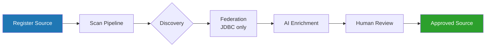
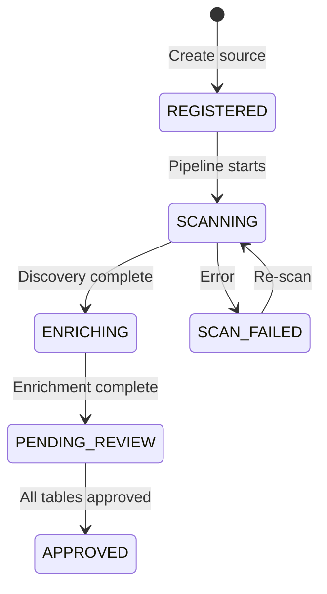

# Structured Data Source Guide

This guide covers how to register, scan, review, and manage structured (database) data sources in Context Ontology Accelerator.

!!! tip "Full request/response schemas"
    This guide shows the workflow, field reference, and key behaviors for
    sources. For the complete request/response schema, every field, and status
    codes for each endpoint, see the **[API Reference](#/api-reference)**
    (Control Plane API → Unified sources) — it's generated directly from the
    API contract and always current.

## Overview

Structured data sources connect your relational databases to Context Ontology Accelerator. Once connected, the platform:

1. **Discovers** tables, columns, and constraints from your database catalog
2. **Provisions** an Athena federated catalog so your data is queryable (JDBC sources)
3. **Enriches** metadata with AI-generated descriptions, synonyms, and key inference
4. **Presents** the enriched metadata for human review before it enters the knowledge graph



## Supported Source Types

| Type | Sub-type | Engine | How it's queried |
|------|----------|--------|-----------------|
| Glue Data Catalog | `GLUE_DATABASE` | Any Glue-registered database | *Athena (native)* - must be already queryable in athena at onboard time |
| JDBC | `JDBC_DATABASE` | PostgreSQL | Direct SQL or Athena federated |
| JDBC | `JDBC_DATABASE` | Redshift | Direct SQL or Athena federated |
| JDBC | `JDBC_DATABASE` | MySQL | Direct SQL or Athena federated |
| JDBC | `JDBC_DATABASE` | SQL Server | Direct SQL or Athena federated |
| JDBC | `JDBC_DATABASE` | Oracle | Athena federated only |
| JDBC | `JDBC_DATABASE` | Snowflake | Athena federated only |
| Custom connector | `CUSTOM_CONNECTOR` | Databricks SQL Warehouse — a ready-made connector ships in `connectors/databricks/` | Athena only (Lambda-backed catalog) |
| Custom connector | `CUSTOM_CONNECTOR` | Any other source you can wrap in an Athena Query Federation SDK connector Lambda | Athena only (Lambda-backed catalog) |

!!! tip "Sources with no native support"
    For a source none of the rows above covers — SAP, a mainframe, an internal
    REST API, a proprietary SaaS product — you can author an Athena Query
    Federation SDK connector Lambda in your own account and onboard it as an
    `CUSTOM_CONNECTOR` source. See
    [Custom Connector Sources](custom-connector-sources.md) for what the
    connector must return, the resource policies you must grant, and the
    governance disclosure that Lake Formation does not apply to that source type.

### Custom data source connectors

A source with no native support above — SAP, a mainframe, an internal REST API, a
proprietary SaaS — reaches COA through an **Athena Query Federation connector**: a Lambda
you deploy in your own account and register as an Athena data catalog. COA then queries it
through Athena, the same federated path a JDBC source uses.

Because a connector supplies its own metadata, you declare what COA would otherwise read
from a database's information schema:

- **Column descriptions** are the Arrow schema's per-column comments.
- **Primary and foreign keys** travel inside those same comments, as `@pk` and
  `@fk(parent_table.parent_column)` tags that COA parses out and strips.

Two COA roles reach a connector and both must be granted: the **serve** role runs queries,
and the **discovery** role runs `DESCRIBE` — which is the only way the key tags are read.
Grant serve alone and the connector answers queries correctly while no declared key is
ever found.

**If you are writing one, start from `connectors/README.md` in your COA checkout** — that guide is
not published on this site. It holds a reference connector to copy, a Java toolkit that handles the
comment placement and tag encoding for you, and a CDK construct that emits the required tag, spill
prefix and resource policies. [Custom Connector Sources](custom-connector-sources.md) is the
contract that guide builds against.

#### Databricks SQL Warehouse

A ready-made connector for Databricks SQL Warehouse ships with COA — you deploy it and register a
`CUSTOM_CONNECTOR` source against it, rather than writing one yourself.

**Its runbook is `connectors/databricks/README.md` in your COA checkout**, not a page on this site:
it covers deployment, creating the credential secret, the three Unity Catalog grants, registering
the source, and the alarms the stack creates. Start from its *Quick start*. Four things to know
before you plan around it:

- **One deployment serves one warehouse**, exposing one Unity Catalog catalog and either one
  pinned schema or every schema in that catalog. A second warehouse needs a second deployment.
- **Declared primary and foreign keys come across automatically**, read from Unity Catalog's
  `information_schema`, so relationships in the ontology come from what your data engineers
  declared rather than from inference. Two limits: a table that declares no constraints
  contributes no keys, and a foreign key whose parent table lies outside the exposed schema is
  dropped. You encode nothing yourself — the connector handles the
  [key-passing format](custom-connector-sources.md#declaring-primary-and-foreign-keys-in-column-comments)
  custom connectors use, and removes any such tag already present in a Unity Catalog column
  comment so it cannot assert a key the warehouse never declared.
- **Aggregations are computed in Athena, not in the warehouse.** Athena federation pushes
  predicates and `LIMIT` down into the warehouse, but never aggregation, so `COUNT`, `SUM` and
  `GROUP BY` read every row matching the predicate. To keep that from becoming an unexplained
  timeout, the connector **fails** any query whose table exceeds a row ceiling — two million
  rows by default, set with `DATABRICKS_MAX_ROWS_PER_TABLE` — with an error naming the table
  and the ceiling. It does not silently return partial results. Narrow the predicate, or raise
  the ceiling together with the connector's memory and timeout.
- **Authentication is a personal access token or OAuth machine-to-machine**, chosen by the
  shape of the Secrets Manager secret you point it at: `{"token": …}` for a token,
  `{"client_id": …, "client_secret": …}` for OAuth. A secret carrying both is rejected.

### Direct SQL vs Athena federated

For JDBC sources, the serve layer picks the query path automatically — you don't
configure it:

- **Direct SQL** — a **single-source** query runs straight against the database over
  its native driver (PostgreSQL/Redshift via asyncpg, MySQL via aiomysql, SQL Server
  via python-tds). This is the low-latency path (roughly 20–50 ms vs ~500–800 ms for
  federation) and is used whenever every table in the query belongs to one direct-SQL
  capable source. The source's `queryEngine` is set to `JDBC` at onboarding for these
  engines.
- **Athena federated** — **cross-source** queries (joining tables from more than one
  source) run through the Athena federated catalog provisioned at onboarding. This is
  always the fallback, so a query that can't take the direct path still resolves.

Both paths are read-only and go through the same SQL firewall. `queryEngine` is a
system-set, read-only field — there is no API or configuration knob for it.

!!! note "Oracle and Snowflake are federation-only"
    Oracle and Snowflake have no direct-SQL driver on the serve path, so every
    query against them — single-source or cross-source — runs through the Athena
    federated catalog. Their `queryEngine` is always `ATHENA` (never `JDBC`), which
    means they always require the federated catalog provisioned at onboarding and
    do not benefit from the low-latency direct-SQL path.

## Registering a JDBC Data Source

### Prerequisites

1. **Credentials in Secrets Manager** — Create a secret with `username` and `password` keys, **tagged with the namespace(s) allowed to use it**:

```bash
aws secretsmanager create-secret \
  --name "coa/jdbc/my-postgres" \
  --secret-string '{"username":"readonly_user","password":"s3cur3!"}' \
  --tags Key=coa:namespace,Value=<namespaceId>
```

!!! warning "The `<prefix>:namespace` tag is required for in-account secrets"
    A credential secret **in the deployment account** must carry a
    `<prefix>:namespace` tag listing the namespace you register the source under.
    Registration reads the tag (via `DescribeSecret`) and rejects a secret that is
    untagged, malformed, or does not list that namespace with a `400`; the
    platform's discovery/serve roles are IAM-restricted to secrets carrying the
    tag.

    **Tag key** — `<prefix>` is the deployment's `resource_prefix` (default
    `coa`), so a deployment named `scl` looks for `scl:namespace`. Two deployments
    sharing one AWS account therefore bind independently: tagging a secret for
    `coa` does not expose it to the `scl` deployment. Check your deployment's
    prefix if you are unsure which key to use.

    **Tag value — one or more namespaces** — the value is a list of namespace
    UUIDs **separated by a single space**, so one credential can serve several
    namespaces (a shared read-only reporting login, say) without duplicating the
    secret:

    ```bash
    aws secretsmanager tag-resource --secret-id <arn> \
      --tags Key=coa:namespace,Value="<namespaceId-1> <namespaceId-2>"
    ```

    The format is validated strictly — every entry must be a namespace UUID, in
    exactly that spacing (no leading/trailing whitespace, no tabs, no doubled
    spaces). A value the API cannot parse is rejected at registration rather than
    accepted and then silently failing every read, since the IAM conditions that
    enforce the same binding match entries on those space boundaries. Secrets
    Manager caps a tag value at 256 characters, so one secret binds at most 6
    namespaces.

    To add or remove a namespace, re-tag the secret with the new list and rescan
    the affected sources (the serve-side grant is refreshed on rescan). Removing a
    namespace from the list revokes its access.

    The tag is checked again on **every scan**, against the secret ARN stored on
    the source. Re-tagging a secret therefore does not silently take effect on
    sources already registered against it: a namespace removed from the list has
    its sources fail their next scan with a message naming the tag. That is what
    makes the binding hold for sources registered before this requirement existed.

    **Existing sources:** credential secrets created before this requirement are
    untagged and will fail discovery/query until they list their namespace. Use the
    migration script rather than tagging by hand — it resolves each secret's
    namespaces from the sources table, **appends** to any existing list rather than
    replacing it, and refuses the two cases it cannot safely write:

    ```bash
    # Report only (read-only). Exits non-zero if anything needs a human.
    scripts/tag_credential_secrets.py --table <prefix>-<env>-sources --region <region>

    # Apply. Add --tag-prefix <prefix> when the deployment is not the default.
    scripts/tag_credential_secrets.py --table <prefix>-<env>-sources --region <region> --apply
    ```

    Run it **before** deploying, so no source scans in the window between the
    deploy and the tagging. It is single-writer: appending is a read-modify-write
    on one tag value, so run it once, from one place. A secret whose existing tag
    does not parse is never overwritten (replacing it could revoke a namespace that
    works today), and a union that would exceed the 6-namespace cap is reported
    rather than truncated.

    This applies only to secrets in the deployment account. A **cross-account**
    credential secret lives in the customer's account (which the deployment does
    not tag); it is authorized by the secret's own resource policy instead — see
    [Cross-Account Data Sources](cross-account-sources.md).

2. **Network access** — The source database must be reachable from the COA VPC. The connector security group needs inbound access on your database port:

| Engine | Default Port |
|--------|-------------|
| PostgreSQL | 5432 |
| Redshift | 5439 |
| MySQL | 3306 |
| SQL Server | 1433 |
| Oracle | 1521 |
| Snowflake | 443 (HTTPS) |

!!! note "Snowflake is a SaaS endpoint, not a private database"
    Snowflake is reached over the public internet on **port 443**, not on a
    private VPC/RDS endpoint like the other engines. The connector security group
    therefore allows egress on 443 (Snowflake wire protocol) **and port 80**, which
    `snowflake-connector-python` uses for OCSP certificate-revocation checks — OCSP
    is an HTTP-only protocol with no HTTPS variant, and the responses are
    cryptographically signed. Both rules are egress-only. Deployments that onboard
    no Snowflake source can drop the port-80 rule with the
    `connector_ocsp_egress = false` Terraform variable, and all connector egress can be
    narrowed from `0.0.0.0/0` to fixed CIDRs with `connector_egress_cidrs`. See the
    internal egress-controls reference for details.

3. **Database user permissions** — The credential user needs `SELECT` on `information_schema` (or equivalent catalog views) for schema discovery.

!!! tip "Cross-account databases"
    If the database, its credential secret, or its VPC live in a different
    account, see [Cross-Account Data Sources](cross-account-sources.md) for
    secret sharing, cross-account roles, and network setup.

### Register via API

Create via `POST /namespaces/{namespaceId}/sources` with `sourceType: "DATABASE"`
and a `databaseSource.jdbcConfiguration` body — see **CreateSource** in the
[API Reference](#/api-reference) for the full request schema and response.

### Register via Web UI

1. Navigate to **Sources** within your namespace
2. Click **Connect source**
3. Select **JDBC Database**
4. Fill in connection details (host, port, database, engine)
5. Provide the Secrets Manager ARN for credentials
6. Optionally configure schema/table filters
7. Click **Connect**

### JDBC Configuration Fields

| Field | Required | Description |
|-------|----------|-------------|
| `engine` | Yes | `POSTGRESQL`, `REDSHIFT`, `MYSQL`, `SQLSERVER`, `ORACLE`, `SNOWFLAKE`. **Set at creation only** |
| `host` | Yes | Database hostname (RFC 1123, max 253 chars). For Snowflake, the account host `<account>.snowflakecomputing.com`. **Set at creation only** |
| `port` | Yes | Port number (1–65535). Snowflake uses `443`. **Set at creation only** |
| `databaseName` | Yes | Target database (alphanumeric + `_` `-`, max 128 chars) |
| `credentialSecretArn` | Yes | Secrets Manager secret ARN with `username`/`password`. In-account secrets must carry a `<prefix>:namespace` tag listing this namespace — space-separate the UUIDs to share one secret across namespaces (see the credentials prerequisite above) **Set at creation only** |
| `crossAccountRoleArn` | No | IAM role to assume for cross-account secret access. The web app's **Connect Source** form requires the role name to contain `{prefix}-datasource-access-` as a convention. The role's trust policy **must** condition on the namespace's `sts:ExternalId` — see [Cross-Account Data Sources](cross-account-sources.md) |
| `schemaFilter` | No | Regex — only schemas matching this pattern are discovered |
| `schemaExcludeFilter` | No | Regex — schemas matching this are excluded (after include filter) |
| `tableFilter` | No | Regex — only tables matching this are discovered |
| `tableExcludeFilter` | No | Regex — tables matching this are excluded |
| `warehouse` | Snowflake only | Virtual warehouse used to run `INFORMATION_SCHEMA` discovery queries and required by federation. **Required for Snowflake** — omitting it fails the scan (`SCAN_FAILED`) at federation time |
| `role` | No (Snowflake only) | Optional Snowflake RBAC role name for the discovery session — a Snowflake construct, **not** an AWS IAM role. Honored during discovery only; federation runs as the secret user's `DEFAULT_ROLE`, so grant that role least-privilege read access |
| `metadataEnrichmentEnabled` | No | `true` (default) or `false` — skip AI enrichment |

!!! warning "`engine`, `host`, `port` and `credentialSecretArn` cannot be changed after creation"
    Updating a source's `jdbcConfiguration` (`PUT .../sources/{sourceId}/metadata`)
    rejects a change to any of these four with a `400`. Together they decide which
    server the platform hands this source's database credentials to, and the
    credential secret is bound to the **namespace**, not to whoever edits the
    source — so anyone with `manageSource` could otherwise redirect a source a
    colleague registered at a host of their own and receive that namespace's
    database credentials. The namespace binding does not catch this on its own: the
    secret is unchanged, only the destination moved.

    They are rejected rather than re-provisioned because the discovered tables,
    their approved metadata and the induced ontology all describe the database at
    the current host, and the update re-discovers none of them. Delete the source
    and create it again to point at a different server or secret.

    Resending an unchanged value is fine, so you can `PUT` the whole configuration
    back to edit a filter. Everything else in the blob — the four `*Filter` fields,
    `warehouse`, `role`, `databaseName` — stays editable.

!!! warning "Snowflake requires a warehouse and relies on the user's DEFAULT_ROLE"
    Snowflake cannot execute queries without an active warehouse, and the managed
    Glue federated connector enforces this at connection-creation time — so
    `warehouse` is mandatory for Snowflake sources. The Glue connector also rejects
    a per-connection `role`, so federation always runs as the credential user's
    Snowflake `DEFAULT_ROLE`. Create that user with
    `DEFAULT_ROLE = <least-privilege read-only role>` so both discovery and
    federated queries stay scoped.

### Input Validation

Host, port, and database name are validated to prevent JDBC parameter injection:

- **host** — alphanumeric + `.` `-` `_`, max 253 chars
- **port** — integer 1–65535
- **database** — alphanumeric + `_` `-`, max 128 chars

## Registering a Glue Data Catalog Source

### Prerequisites

- The Glue database must exist in the same or a cross-account Data Catalog
- The COA deployment role needs `glue:GetDatabase`, `glue:GetTables`, `glue:GetTable` permissions
- **The database must be registered to your namespace with the `{prefix}:namespace` tag** (same-account catalogs only — see below)

#### Registering a database to a namespace

A namespace may only catalog a Glue database whose owner has opted in. Ownership
cannot be inferred — every namespace's discovery connector shares one deployment
role, so any database in the deployment account is technically readable by it.
The tag is what says which namespace is allowed to.

The tag key follows the resource prefix you set at deploy time, so it is
`<your-prefix>:namespace` — `coa:namespace` on a default deployment. The examples
below use the default; substitute your own prefix. The same key and value format
bind a JDBC source's credential secret and a document source bucket, so a namespace
is declared the same way on all three.

```bash
aws glue tag-resource \
  --resource-arn arn:aws:glue:us-east-1:111122223333:database/sales \
  --tags-to-add '{"coa:namespace":"<namespaceId>"}'
```

| Tag value | Effect |
|-----------|--------|
| `<namespaceId>` | Only that namespace may catalog the database |
| `<nsA> <nsB>` | **Space**-separated list; each listed namespace may catalog it |
| `ALL` | Every namespace in the deployment may catalog it (case-insensitive) |

!!! note "Why a space, and why `ALL` rather than `*`"
    Glue validates tag values against `[\p{L}\p{Z}\p{N}_.:/=+\-@]*`, which excludes
    both `,` and `*` — `aws glue tag-resource` rejects them with
    `InvalidInputException`. A single space is the canonical separator, and it is also
    what the IAM entry-boundary conditions that enforce this binding match on, so a
    comma form is rejected rather than tolerated. `ALL` is the share-with-everyone
    sentinel; namespace ids are UUIDs, so it can never collide with one.

    The same `{prefix}:namespace` key and space-separated value bind a JDBC source's
    **credential secret** to its namespaces.

Creating a source against an untagged or differently-tagged database returns
**403** naming the tag to add. The tag is also re-checked at every scan, so
removing it stops future scans (already-discovered metadata is unaffected).

Two cases need no tag:

- **Cross-account databases** reached via `crossAccountRoleArn` — the role's trust
  policy is already the authorization, and the tags are the other account's to set.
- **Managed federated catalogs** that COA provisioned for a JDBC source
  (`{prefix}ds_*`). These are owned by the namespace whose source created them and
  cannot be named as another namespace's Glue source at all; a tag does not
  override that.

!!! tip "Cross-account catalogs"
    For a Glue catalog in a different account — or a Lake Formation–governed
    catalog — see [Cross-Account Data Sources](cross-account-sources.md) for the
    required resource policies and Lake Formation grants.

### Register via API

Create via `POST /namespaces/{namespaceId}/sources` with `sourceType: "DATABASE"`
and a `databaseSource.glueConfiguration` body — see **CreateSource** in the
[API Reference](#/api-reference) for the full request schema and response.

### Glue Configuration Fields

| Field | Required | Description |
|-------|----------|-------------|
| `catalogId` | **Yes** | Glue Data Catalog ID: a 12-digit AWS account ID (root catalog), or `account:catalogName` for nested/federated/cross-account catalogs. Pattern-validated (`^\d{12}(:[a-zA-Z0-9_/-]+)?$`), 12–256 chars |
| `region` | **Yes** | AWS region the catalog/database lives in |
| `databaseName` | Yes | Glue database name |
| `tableFilter` | No | Regex — only tables matching this are discovered |
| `tableExcludeFilter` | No | Regex — tables matching this are excluded |
| `crossAccountRoleArn` | No | IAM role ARN the discovery connector assumes to read catalog metadata in a different account. The web app's **Connect Source** form requires the role name to contain `{prefix}-datasource-access-` as a convention. The role's trust policy **must** condition on the namespace's `sts:ExternalId` — see [Cross-Account Data Sources](cross-account-sources.md) |
| `externalId` | No | **Deprecated — ignored.** The ExternalId is derived server-side from the namespace and cannot be set through the API; a value supplied here is discarded. Read the value to pin in your trust policy from `datasourceExternalId` on `GET /namespaces/{namespaceId}`. See [Cross-Account Data Sources](cross-account-sources.md) |
| `athenaDataCatalogName` | No | Explicit Athena catalog name (overrides auto-resolution) |

!!! warning "`catalogId` and `databaseName` are fixed at creation"
    An update that changes either returns **400**. They are what the namespace was
    authorized against, and the discovered tables, their approved metadata and the
    induced ontology all describe them — so a repoint would leave every one of
    those describing something the source no longer points at. Delete the source
    and create it again against the new target. Echoing the stored values back is
    allowed, so other fields in the blob stay editable.

## Monitoring Scans

After registering a source, a scan pipeline runs automatically. Monitor its progress:

### Source Status Lifecycle



### Poll Source Status

Poll `GET /namespaces/{namespaceId}/sources/{sourceId}` and check the `status`
field. Scan job detail (including the `errorMessage` field on failure) is
available via `GET .../sources/{sourceId}/scan/{jobId}` — see
**GetSource** / **GetSourceScanJob** in the [API Reference](#/api-reference).

### Interpreting Errors

| Status | Meaning | Action |
|--------|---------|--------|
| `SCAN_FAILED` | Discovery or federation failed | Check source credentials and network connectivity; re-scan |
| `ENRICHING` stuck | Bedrock throttling or timeout | Wait and retry; check CloudWatch for `BedrockThrottleCount` metric |
| Federation error with "Insufficient Lake Formation permission" | Provisioner role is not an LF data-lake admin | See [Lake Formation bootstrap](getting-started.md) |

When a scan fails, the scan history in the web UI now surfaces the **actual
error message** captured from the failed scan job (the `errorMessage` field
returned by the scan-job endpoint above). This makes it easier to diagnose connection failures,
permission issues, and other scan problems directly from the UI. The same `errorMessage` is available programmatically on
the `GET .../scan/{jobId}` response.

### Skipping AI Enrichment

If you don't need AI-generated metadata and want faster scans, disable enrichment at creation:

```json
{ "metadataEnrichmentEnabled": false }
```

The source transitions `SCANNING → PENDING_REVIEW` directly, skipping the `ENRICHING` phase. You can toggle `metadataEnrichmentEnabled` later (see "Updating Source-Level Metadata" below); re-running enrichment on an already-scanned source is part of the planned schema-drift re-scan enhancement (see "Triggering Re-scans" below).

## Reviewing Enriched Metadata

After a scan completes, the source enters `PENDING_REVIEW`. Review the discovered tables and columns before they become queryable.

### Filtering Tables by Review Status

The source detail page in the web UI includes a status dropdown above the
tables list that filters by review status: **All statuses**, **Pending
review**, **Approved**, and **Rejected**. On large sources this lets you focus
on the tables that still need attention (`Pending review`) without scrolling
past already-reviewed tables. The filter maps to the `reviewStatus` query
parameter on **ListSourceTables** in the [API Reference](#/api-reference).

### List and Get Table Detail

List all tables via `GET .../sources/{sourceId}/tables`, or get a single
table's full detail (technical + AI-enriched metadata, `reviewStatus`,
`enrichmentSource`) via `GET .../tables/{tableId}` — see **ListSourceTables**
/ **GetSourceTable** in the [API Reference](#/api-reference).

### Approve or Reject a Single Table

`PUT .../tables/{tableId}/review` with `{ "decision": "APPROVED" }` or
`{ "decision": "REJECTED" }` — see **ReviewSourceTable** in the
[API Reference](#/api-reference) for the full request/response shape.

**Cascade behavior:**
- **Approving** a table cascades to its `PENDING_REVIEW` columns. Columns you've explicitly `REJECTED` are preserved — they won't be flipped by a table-level approve.
- **Rejecting** a table cascades to ALL non-rejected columns (including previously approved ones).

### Approve/Reject a Column

The same `{ "decision": ... }` body applies at the column level via
`PUT .../tables/{tableId}/columns/{columnName}/review` — see
**ReviewSourceColumn** in the [API Reference](#/api-reference).

### Bulk Approve/Reject All (Async)

For sources with many tables, `POST .../sources/{sourceId}/approve` or
`.../reject` bulk-processes all tables. Both return `202 Accepted` (see
**ApproveSource** / **RejectSource** in the [API Reference](#/api-reference)):

- **Approve:** the source enters `APPROVING` status while a background worker processes all tables. Poll the source status until it reaches `APPROVED`. Only `PENDING_REVIEW` tables and columns are touched — anything already explicitly approved or rejected is preserved.
- **Reject:** after completion, the source returns to `PENDING_REVIEW` (not `APPROVED`), allowing further review.

## Editing Metadata as a Steward

Stewards can edit AI-generated metadata to correct descriptions, add context, or fix key relationships.

### Edit Table or Column Metadata

`PATCH .../tables/{tableId}/metadata` with an `{ "overrides": {...} }` body
(`description`, `synonyms`, `glossaryTerms`, `tags`) edits table-level
metadata. The same shape applies at the column level via
`PATCH .../tables/{tableId}/columns/{columnName}/metadata` (typically just
`description`). See **UpdateSourceTableMetadata** / **UpdateSourceColumnMetadata**
in the [API Reference](#/api-reference) for all overridable fields.

### Edit Primary & Foreign Keys

`PATCH .../tables/{tableId}/keys` with `primaryKey`/`foreignKeys` fields — see
**UpdateSourceTableKeys** in the [API Reference](#/api-reference) for the
full request schema.

- Omitting a field leaves it unchanged; an empty list clears it
- Column names are validated against the table's actual columns
- Steward-specified keys are tagged `STEWARD_SPECIFIED` and override AI-inferred keys

### Metadata Priority Hierarchy

Edits follow a priority system. Higher-priority sources are never overwritten by lower-priority ones:

| Priority | Source | Survives re-scan? |
|----------|--------|-------------------|
| 1 (highest) | `STEWARD_EDITED` / `STEWARD_SPECIFIED` | ✅ Always preserved |
| 2 | `DETERMINISTIC` (from DB constraints) | ✅ Re-discovered |
| 3 (lowest) | `AI_GENERATED` | Re-generated (may change) |

!!! note
    Editing metadata does NOT change the review status. To approve after editing, make a separate `PUT /review` call. This is intentional — the "edit + approve" UX is two distinct actions.

## Triggering Re-scans

!!! note
    For structured (database) sources, re-scan is a **recovery action only** — it
    is permitted **only when the source is in `SCAN_FAILED` status**. Re-scanning
    an already-scanned source to pick up schema changes (DDL drift) is a **planned
    enhancement for a future phase** and is not yet supported. Calling re-scan on a
    database source in any other status returns a `409 Conflict`
    (`Re-scan is only allowed when status is 'SCAN_FAILED'`).

Re-scan a failed source to retry the scan pipeline after correcting the
underlying problem (for example, fixed credentials, restored network
connectivity, or granted Lake Formation permissions) via
`POST .../sources/{sourceId}/rescan` — see **RescanSource** in the
[API Reference](#/api-reference).

### When to Re-scan

- After a scan fails (`SCAN_FAILED`) and you have corrected the cause — bad
  credentials, an unreachable host, or missing Lake Formation permissions

### What Happens on Re-scan

1. The source transitions `SCAN_FAILED → SCANNING` and the scan pipeline restarts
2. Discovery, federation (JDBC only), and AI enrichment run again
3. Steward edits are preserved (see the metadata priority hierarchy above)

!!! info "Coming in a future phase"
    Schema-drift re-scans of healthy or approved sources — discovering new
    tables/columns, cleaning up removed objects, and re-enriching with change
    detection — are a planned enhancement and not yet available.

## Updating Source-Level Metadata

Update the source's name, description, or toggle enrichment via
`PUT .../sources/{sourceId}/metadata` — see **UpdateSourceMetadata** in the
[API Reference](#/api-reference).

## Deleting a Data Source

`DELETE /namespaces/{namespaceId}/sources/{sourceId}` — see **DeleteSource**
in the [API Reference](#/api-reference).

### What Gets Removed

| Resource | Cleanup |
|----------|---------|
| DynamoDB source record | Deleted |
| DynamoDB scan job records | Deleted |
| DataZone assets (tables) | Deleted |
| Glue Connection (JDBC) | Deleted |
| Glue Federated Catalog (JDBC) | Deleted |
| Lake Formation registration (JDBC) | Deregistered |
| Namespace source counter | Decremented |

!!! warning
    JDBC source deletion requires the federation provisioner role to have Lake Formation data-lake admin privileges. If teardown fails, the delete returns `500` and the source remains — retry once the prerequisite is met.

## Querying via Athena

Once a source is scanned and approved, it's queryable via Amazon Athena using the namespace's dedicated workgroup.

### JDBC Sources (4-part naming)

```sql
SELECT *
FROM "AwsDataCatalog"."coa-dev-ds_a1b2c3d4"."public"."orders"
LIMIT 100;
```

The catalog and connection names are available on the source detail
(`GET /namespaces/{namespaceId}/sources/{sourceId}` →
`databaseDetails.athenaDataCatalogName`) — see **GetSource** in the
[API Reference](#/api-reference).

### Glue Sources (3-part naming)

```sql
SELECT *
FROM "my_data_lake"."orders"
LIMIT 100;
```

## Authorization

| Action | Required Role |
|--------|--------------|
| List sources | Any namespace role (`viewNamespace`) |
| Create source | `namespace-owner`, `data-steward`, or `platform-admin` |
| View source/tables | Any namespace role (`viewNamespace`) |
| Review/edit metadata | `namespace-owner`, `data-steward`, or `platform-admin` |
| Delete source | `namespace-owner`, `data-steward`, or `platform-admin` |
| Re-scan | `namespace-owner`, `data-steward`, or `platform-admin` |

## Troubleshooting

| Symptom | Cause | Fix |
|---------|-------|-----|
| `SCAN_FAILED` immediately | Bad credentials or host unreachable | Verify secret has `username`/`password`; check SG allows inbound from connector SG |
| Discovery succeeds, enrichment fails | Bedrock access not granted or throttled | Verify Bedrock model access; check `BedrockThrottleCount` metric |
| Athena query: "Catalog not found" | Source hasn't been scanned, or federation step failed | Re-scan; check pipeline logs |
| Athena query: connection timeout | Source DB security group blocks connector SG | Add inbound rule from connector SG on the DB port |
| `409` on review/edit | Source is in a transient state (`SCANNING`, `APPROVING`) | Wait for pipeline to complete |
| Bulk approve stuck in `APPROVING` | Worker Lambda timed out | Check worker CloudWatch logs; retry the POST |
| Delete returns 500 | Federation teardown failed (LF admin missing) | Register the provisioner role as LF admin; retry |
| `403 ... is not registered to namespace` on Glue source create | The target database carries no `coa:namespace` tag for this namespace | Have the database owner apply the tag — the error message contains the exact `aws glue tag-resource` command |
| `403 ... managed federated catalog that namespace ... does not own` | `catalogId` names a `{prefix}ds_*` catalog COA provisioned for another namespace's JDBC source | Register the upstream database as your own source with `jdbcConfiguration` instead of pointing a Glue source at someone else's catalog |
| Glue source `SCAN_FAILED` with `not registered to namespace` after previously scanning fine | The `coa:namespace` tag was removed or changed after onboarding; the ownership check re-runs on every scan | Re-apply the tag and re-scan, or delete the source if the opt-in was withdrawn deliberately |
| Every Glue source create returns 403 in a fresh deployment | The API role is missing `glue:GetTags` **or** `glue:GetDatabase`, so the check cannot read the tag and fails closed. Glue authorizes `GetTags` on a database against `glue:GetDatabase` on the catalog, so both are required | Confirm the `GlueOwnershipTagRead` statement on the `sources-api` role grants both actions (deploy the current infra); the Lambda logs a `glue_get_tags_failed` warning naming the missing action |
| `InvalidInputException: Invalid Tag Parameters` when tagging | The tag value contains `,` or `*`, which Glue rejects | Use a space-separated list, or `ALL` to share with every namespace |
| `Unsupported database engine: <ENGINE>` on connect | The `engine` value is not one of the supported engines listed above | Use a supported engine, or register the database through the Glue Data Catalog instead |
| Snowflake `SCAN_FAILED` right after discovery succeeds | No `warehouse` set — federation is rejected at connection creation (`WAREHOUSE are missing in the request object`) | Set `jdbcConfiguration.warehouse` to an active Snowflake virtual warehouse and re-scan |
| Snowflake/Oracle scan succeeds but Athena queries return `TABLE_NOT_FOUND` on an empty catalog | Historical casing-filter bug (fixed) — the federated catalog resolved but exposed zero objects because Snowflake/Oracle fold unquoted identifiers to UPPERCASE | Fixed in current releases (the lowercase casing filter is no longer sent for Oracle/Snowflake). Delete and re-create the source if it was onboarded before the fix — the property is non-updatable |
| `SCAN_FAILED` with `... exceeding the limit of N` | Source has more tables than `MAX_TABLES_PER_SOURCE` (default `10000`); discovery fails fast rather than hitting the Lambda timeout | Narrow the scan scope with `schemaFilter` / `schemaExcludeFilter` / `tableFilter` (e.g. exclude system schemas like `schemaExcludeFilter: "information_schema\|pg_catalog\|sys"`). If a larger source genuinely needs to be scanned in one pass, raise (or set `0` to disable) the `MAX_TABLES_PER_SOURCE` env var on the `sources-db-connector` Lambda. |
| Scan times out on a very large Glue/Athena catalog | Enum sampling issues one Athena query per candidate column; the fan-out has to fit inside the scan Lambda timeout | Sampling queries run in parallel, capped by the `ATHENA_SAMPLING_CONCURRENCY` env var on the `sources-db-connector` Lambda (default `16`). Raise it if the account's Athena concurrent-DML quota allows more in-flight queries — that quota, not this setting, is the real ceiling. A non-numeric value falls back to `16`, and the effective concurrency is floored at `1`. |

### Custom connector issues

Symptoms specific to a source reached through an Athena federation connector. The connector's own
guide (`connectors/README.md`) covers each in more depth.

| Symptom | Cause | Fix |
|---------|-------|-----|
| Tables are discovered but no primary or foreign keys arrive | The discovery role has no `lambda:InvokeFunction` on the connector, so `DESCRIBE` — the only thing that reads the key tags — never ran | Grant the role named by `/{prefix}/sources/db-connector-role-arn`. Queries work without it, which is why this looks like a metadata problem rather than a permissions one |
| `DESCRIBE` returns names and types with no comment column | The connector put comments on the Arrow *field* rather than in the schema's metadata, where Athena reads them | Build the schema with the toolkit's `TableSchema`, which makes the working placement the only one expressible |
| A large result returns **zero rows** with status `SUCCEEDED` | The connector could not write its spill: no `spill_bucket`, the wrong prefix, or no `s3:PutObject` under it | Check the Lambda's `spill_bucket` and that `spill_prefix` is `connectors/<id>/spills`; confirm objects appear there during a query |
| `AccessDenied`, but only on large results | Spill is read with the *querying* role's credentials, not the connector's | Grant the serve and discovery roles `s3:GetObject` under the spill prefix and `kms:Decrypt` on the spill key |
| A `@fk(...)` tag appears verbatim in a stored description | The tag was malformed, and the parser's warning goes to COA's logs rather than the connector's | Build tags with the toolkit's `ColumnComment` rather than by hand |
| Every read fails while metadata calls succeed | The connector's Lambda is missing `JAVA_TOOL_OPTIONS=--add-opens=java.base/java.nio=ALL-UNNAMED`, which Arrow needs on Java 17 | Set it; the CDK construct does this for you |

## Document Sources

### Local Upload

Upload files directly through the web app:

1. Navigate to your namespace → **Sources** → **Connect Source**
2. Select **Documents** source type
3. Click **Get Upload URLs** to obtain pre-signed S3 URLs
4. Upload files (PDF, TXT, DOCX, HTML — max 50MB per file)
5. Click **Create Source** — files are preprocessed and ingested into the knowledge graph

### Via the API

Creating a document source from local files is a three-call sequence — see
**GetSourceUploadUrls** and **CreateSource** in the
[API Reference](#/api-reference) for the full request/response schemas:

1. `POST /namespaces/{namespaceId}/sources/upload-urls` with the list of
   files (`fileName`, `contentType`) to get back a pre-signed S3 URL per file,
   plus a server-issued `uploadId` for the session.
2. `PUT` each file's bytes directly to its pre-signed URL.
3. `POST /namespaces/{namespaceId}/sources` with `sourceType: "DOCUMENTS"` and
   the `uploadId` returned in step 1, to create the source and kick off
   ingestion. The ingest prefix is derived server-side as
   `{namespaceId}/raw/{uploadId}/`; any `s3Prefixes` sent on an upload source is
   ignored (it cannot be used to read another namespace's objects).

### S3 Bucket Source (Same Account)

Create directly via `POST /namespaces/{namespaceId}/sources` with
`sourceType: "DOCUMENTS"` and a `documentSource.sourceBucketArn` +
`s3Prefixes` pointing at an existing bucket — no upload step needed. See
**CreateSource** in the [API Reference](#/api-reference).

!!! important "Tag the bucket to authorize the namespace"
    Before registering, tag the bucket so it names the namespaces allowed to read
    it. `CreateSource` verifies the tag and returns `400` without it. The key is
    `{prefix}:namespace`, where `{prefix}` is your deployment's resource prefix
    (e.g. `coa`):

    ```
    {prefix}:namespace = <namespaceId>
    ```

    Separate several namespace ids with spaces to let one bucket serve more than
    one namespace:

    ```
    coa:namespace = aaaaaaaa-1111-4aaa-8aaa-aaaaaaaaaaaa bbbbbbbb-2222-4bbb-8bbb-bbbbbbbbbbbb
    ```

    A tag value caps at 256 characters, so a bucket can list at most six namespaces.

    Only a principal with `s3:TagResource` on the bucket can set this, which is what
    makes the tag proof that the bucket's owner authorized the read — naming a
    bucket in the request does not.

    ```bash
    aws s3api put-bucket-tagging --bucket <bucket> \
      --tagging 'TagSet=[{Key=coa:namespace,Value=<namespaceId>}]'
    ```

    (substituting your prefix for `coa` in the key)

    Note `put-bucket-tagging` **replaces** the whole tag set, so include any tags
    the bucket already carries.

    **Existing sources:** buckets registered before this requirement are untagged
    and their next scan will fail until you add the tag. Tag the bucket and re-scan
    the source — nothing needs recreating and no documents are re-ingested. Do it
    before upgrading if you want no failed scans in between; afterwards is equally
    safe, since a source that fails this check has read nothing.

    **Upload sources are unaffected** — they read the platform's own bucket, which
    no customer tags.

### S3 Bucket Source (Cross-Account)

For documents in a different AWS account, add a `roleArn` that Ontology
Accelerator can assume, alongside `sourceBucketArn` and `s3Prefixes` (same
**CreateSource** request, [API Reference](#/api-reference)):

The role must:
- Trust the Context Ontology Accelerator sources Lambda to assume it
- Follow the naming convention: role name must start with `{prefix}-` (e.g. `coa-`)
- Have `s3:GetObject` and `s3:ListBucket` on the source bucket

The bucket must **also** carry the `{prefix}:namespace` tag described above — the role
grants the platform the ability to read, the tag records which namespaces are
authorized to. Both are required; the role alone is not sufficient. The platform's
own role needs `s3:GetBucketTagging` on the bucket to read that tag, so include it
alongside `s3:GetObject` and `s3:ListBucket`.

### Document Processing Pipeline

After creation, documents go through:

1. **Preprocessing** — extracts text, splits into chunks, validates file size
2. **Entity extraction** — identifies concepts and relationships from text
3. **Knowledge graph build** — creates nodes/edges in Neptune
4. **Embedding** — vectorizes chunks for semantic search in OpenSearch

### Configuring Document Extraction

Document sources accept an optional `extractionConfig` object that tunes how the
knowledge graph is built from your documents. All fields are optional; the
defaults are tuned for general prose corpora.

| Field | Type | Default | Purpose |
|-------|------|---------|---------|
| `preferredEntityClassifications` | `string[]` | `[]` (unset) | Explicit entity-class vocabulary handed to the extraction LLM. |
| `inferEntityClassifications` | `boolean` | `true` | Derive the entity-class vocabulary from your corpus at ingest start. |
| `enableTableExtraction` | `boolean` | `false` | Route PDFs through Amazon Textract to preserve table structure. |
| `chunkSize` | `integer` | `0` (toolkit default 256) | Token size of each extraction/embedding chunk. |
| `chunkOverlap` | `integer` | `0` (toolkit default 25) | Token overlap between adjacent chunks. |

#### Entity vocabulary: `preferredEntityClassifications` and `inferEntityClassifications`

By default the extractor derives the entity-class vocabulary from **your own
documents** (`inferEntityClassifications: true`). This avoids typing your graph
against a generic news/finance vocabulary that would not match domains such as
insurance, healthcare, or manufacturing.

To pin an explicit vocabulary instead, set `preferredEntityClassifications` to
the exact class labels you want (case-sensitive, spaces allowed):

```json
{
  "extractionConfig": {
    "preferredEntityClassifications": ["Policy", "Claim", "Loss Ratio", "Policyholder"]
  }
}
```

When `preferredEntityClassifications` is non-empty it **overrides** inference —
the extractor uses exactly those labels. Leave it empty (the default) to fall
back to corpus inference. If both are effectively off (empty list and
`inferEntityClassifications: false`), extraction runs unguided.

#### Table-heavy PDFs: `enableTableExtraction`

For PDFs whose meaning lives in tables (premium schedules, rate cards, spec
sheets), set `enableTableExtraction: true`. Every PDF is then routed through
Amazon Textract's `AnalyzeDocument` with the `TABLES` feature, which preserves
row/column structure as Markdown tables instead of flattening them into prose.

```json
{
  "extractionConfig": {
    "enableTableExtraction": true
  }
}
```

This costs materially more per page than the default text extraction, so leave
it off for prose-dominant corpora.

#### Chunking: `chunkSize` and `chunkOverlap`

`chunkSize` and `chunkOverlap` (in tokens) control how documents are split for
extraction and embedding. `0` (the default for both) means "use the toolkit
default" — `chunkSize` 256, `chunkOverlap` 25. Set a positive `chunkSize`
(e.g. 1024) to keep more context per chunk for dense or tabular corpora:

```json
{
  "extractionConfig": {
    "chunkSize": 1024,
    "chunkOverlap": 100
  }
}
```

`chunkOverlap` must be smaller than `chunkSize`; if it is set greater than or
equal to `chunkSize` it is clamped down (with a logged warning) so chunking
still produces valid chunks.

## Cross-Account Sources

For the full step-by-step on cross-account JDBC (network, credentials, secret policies) and cross-account Glue (IAM mode, Lake Formation, RAM sharing, VPC peering), see [Cross-Account Data Sources](cross-account-sources.md).
